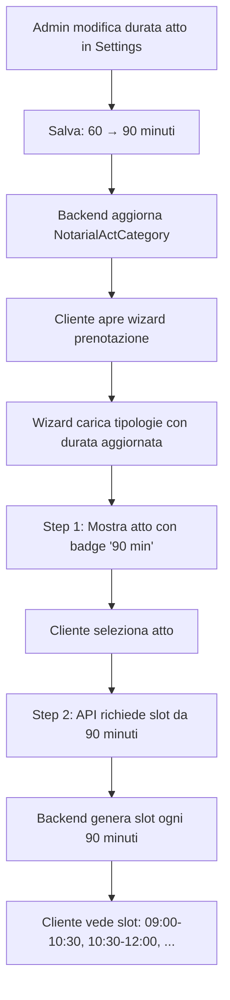

# 📋 Gestione Tipologie Atti - Admin Dashboard

## ✅ Implementazione Completata

### 🎯 Funzionalità Principali

#### 1️⃣ **Backend API** (`/api/acts/categories/`)

**Endpoint disponibili:**

```
GET    /api/acts/categories/              # Lista tutte le categorie
GET    /api/acts/categories/{id}/         # Dettaglio categoria con documenti
POST   /api/acts/categories/              # Crea nuova categoria (Admin)
PUT    /api/acts/categories/{id}/         # Modifica categoria (Admin)
DELETE /api/acts/categories/{id}/         # Elimina categoria (Admin)

# Gestione documenti
POST   /api/acts/categories/{id}/add_document/           # Aggiungi documento
DELETE /api/acts/categories/{id}/remove_document/{doc_id}/  # Rimuovi documento

# Document Types
GET    /api/acts/document-types/          # Lista tipi documento
POST   /api/acts/document-types/          # Crea tipo documento (Admin)
PUT    /api/acts/document-types/{id}/     # Modifica tipo documento (Admin)
DELETE /api/acts/document-types/{id}/     # Elimina tipo documento (Admin)
```

**Dati Categoria:**
```json
{
  "id": 1,
  "code": "COMPRAVENDITA_IMMOBILIARE",
  "name": "Compravendita Immobiliare",
  "description": "Atto di compravendita per immobili",
  "estimated_duration_minutes": 90,
  "main_category": 1,
  "main_category_name": "Atti Immobiliari",
  "is_active": true,
  "document_count": 15,
  "required_documents": [
    {
      "id": 1,
      "document": {
        "id": 5,
        "name": "Carta d'Identità",
        "code": "CARTA_IDENTITA",
        "category": "identita",
        "description": "Documento di identità valido"
      },
      "is_mandatory": true,
      "order": 0,
      "notes": ""
    }
  ]
}
```

---

#### 2️⃣ **Admin Dashboard - Tab "Tipologie Atti"**

**Posizione:** Dashboard Admin → Impostazioni → Tab "Tipologie Atti"

**Visualizzazione:**
- ✅ **41 tipologie di atto** caricate dal database
- ✅ Card per ogni tipologia con:
  - Nome e codice
  - Categoria principale
  - Durata stimata (minuti)
  - Numero documenti richiesti
  - Stato (Attivo/Non Attivo)

**Azioni disponibili (modalità Modifica):**
- ✅ **Modifica** - Apre modale per modificare nome, descrizione, durata
- ✅ **Attiva/Disattiva** - Toggle stato attivo
- ✅ **Nuovo** - Crea nuova tipologia (nota: richiede code e main_category)

**Modale Modifica:**

**Tab 1: Dettagli**
- Nome Tipologia
- Descrizione
- Durata Stimata (minuti)
- Stato Attivo/Non Attivo

**Tab 2: Documenti Richiesti**
- Lista documenti già richiesti con pulsante "Rimuovi"
- Lista documenti disponibili con pulsante "Aggiungi"
- Filtro automatico (documenti già richiesti non appaiono nella lista "disponibili")

---

#### 3️⃣ **Wizard Prenotazione Cliente**

**Step 1: Selezione Tipo di Atto**
- ✅ Carica le **41 tipologie** dal backend
- ✅ Paginazione: **12 card per pagina** (4 pagine totali)
- ✅ Frecce navigazione `← 1 di 4 →`
- ✅ Ogni card mostra:
  - Icona
  - Nome (max 2 righe)
  - Badge durata (es. "90 min")

**Step 2: Selezione Data/Ora**
- ✅ Usa la **durata dal backend** (`estimated_duration_minutes`)
- ✅ Slot generati dinamicamente in base alla durata:
  - **30 minuti** → Slot ogni 30 min (09:00-09:30, 09:30-10:00, ...)
  - **60 minuti** → Slot ogni 60 min (09:00-10:00, 10:00-11:00, ...)
  - **90 minuti** → Slot ogni 90 min (09:00-10:30, 10:30-12:00, ...)

---

### 🔄 Flusso Completo



---

### 📁 File Modificati/Creati

#### Backend:
1. ✅ `backend/acts/models.py`
   - Aggiunto campo `estimated_duration_minutes` a `NotarialActCategory`

2. ✅ `backend/acts/migrations/0002_*.py`
   - Migration per aggiungere il campo

3. ✅ `backend/acts/serializers.py`
   - `DocumentTypeSerializer` - Nuovo
   - `NotarialActCategoryDocumentSerializer` - Nuovo
   - `NotarialActCategorySerializer` - Aggiornato con durata e documenti

4. ✅ `backend/acts/views.py`
   - `NotarialActCategoryViewSet` - Cambiato da ReadOnly a ModelViewSet
   - `DocumentTypeViewSet` - Nuovo
   - Azioni custom: `add_document`, `remove_document`

5. ✅ `backend/acts/urls.py`
   - Registrato `DocumentTypeViewSet`

#### Frontend:
1. ✅ `frontend/src/services/actCategoriesService.js` - **NUOVO**
   - Service completo per gestione categorie e documenti

2. ✅ `frontend/src/components/SettingsAdmin.jsx` - **RISCRITTO**
   - Mostra 41 tipologie di atto dal backend
   - Modale edit/create con tab Dettagli e Documenti
   - Gestione completa documenti (aggiungi/rimuovi)

3. ✅ `frontend/src/components/Settings.css`
   - Aggiunti stili per card tipologie
   - Stili per modale con tabs
   - Stili per lista documenti

4. ✅ `frontend/src/components/AppointmentBooking.jsx`
   - Usa `estimated_duration_minutes` dal backend
   - Paginazione 12 card per pagina
   - Toggle selezione card

5. ✅ `frontend/src/components/AppointmentCalendar.jsx`
   - Riceve prop `duration`
   - Passa durata all'API backend
   - Ricarica slot quando cambia la durata

---

### 🧪 Come Testare

#### Test 1: Visualizzazione Admin

```bash
# 1. Login come admin
Email: admin@sportellonotai.sm
Password: admin123

# 2. Vai a: Dashboard Admin → Impostazioni
# 3. Verifica che vedi le 41 tipologie di atto
```

**Cosa verificare:**
- ✅ Vedi tutte le 41 tipologie
- ✅ Ogni card mostra: nome, code, categoria, durata, n° documenti
- ✅ Badge "Attivo" o "Non Attivo"

#### Test 2: Modifica Durata

```bash
# 1. Clicca "Modifica" in alto a destra
# 2. Clicca icona matita su una tipologia (es. "Compravendita Immobiliare")
# 3. Tab "Dettagli" → Cambia durata da 60 a 90 minuti
# 4. Clicca "Salva"
# 5. Esci dalla modalità modifica
```

**Cosa verificare:**
- ✅ Modale si apre correttamente
- ✅ Form è popolato con i dati esistenti
- ✅ Puoi modificare la durata
- ✅ Toast "Tipologia atto aggiornata"
- ✅ Card aggiornata con nuova durata

#### Test 3: Gestione Documenti

```bash
# 1. Modifica una tipologia
# 2. Tab "Documenti Richiesti"
# 3. Sezione sinistra: vedi documenti già richiesti
# 4. Sezione destra: vedi documenti disponibili da aggiungere
# 5. Clicca "+" su un documento disponibile
# 6. Clicca "Rimuovi" su un documento richiesto
```

**Cosa verificare:**
- ✅ Documenti richiesti elencati correttamente
- ✅ Aggiunta documento funziona (toast + aggiornamento lista)
- ✅ Rimozione documento funziona
- ✅ Documento rimosso appare nella lista "disponibili"

#### Test 4: Propagazione al Wizard

```bash
# 1. Modifica durata di "Compravendita Immobiliare" → 90 minuti
# 2. Logout admin
# 3. Login come cliente (cliente@example.com / password123)
# 4. Clicca su card notaio → "Prenota Appuntamento"
# 5. Step 1: cerca "Compravendita Immobiliare"
# 6. Verifica badge "90 min"
# 7. Seleziona e vai a Step 2
# 8. Verifica slot: dovrebbero essere ogni 90 minuti
```

**Cosa verificare:**
- ✅ Badge mostra durata aggiornata
- ✅ Slot calendario ogni 90 minuti
- ✅ Console mostra: `📅 Calendario caricato con durata: 90 minuti`

#### Test 5: Disattivazione Tipologia

```bash
# 1. Admin: disattiva una tipologia (icona check → alert)
# 2. Badge diventa "Non Attivo" (rosso)
# 3. Logout e login come cliente
# 4. Wizard Step 1: la tipologia disattivata NON appare
```

**Cosa verificare:**
- ✅ Admin vede tutte le tipologie (anche disattive)
- ✅ Cliente vede solo tipologie attive
- ✅ Paginazione si adatta (es: se 5 disattivate, cliente vede 36 = 3 pagine)

---

### 🐛 Troubleshooting

#### Problema: "Nessuna tipologia di atto trovata"

**Causa:** Database vuoto o API non raggiungibile

**Soluzione:**
```bash
cd backend
python manage.py shell -c "from acts.models import NotarialActCategory; print(NotarialActCategory.objects.count())"

# Se 0:
python manage.py populate_act_categories
```

#### Problema: Durata non si aggiorna nel wizard

**Causa:** Cache frontend o API che ritorna vecchi dati

**Soluzione:**
1. Hard refresh: `Ctrl+Shift+R` (o `Cmd+Shift+R` su Mac)
2. Verifica console browser:
   ```
   📊 Tipologie atto caricate dal backend: 41
   ✅ Card configurate: 41
   ```
3. Verifica che `estimated_duration_minutes` sia nel response API

#### Problema: "Errore aggiunta documento"

**Causa:** Documento già richiesto o ID non valido

**Verifica:**
```bash
cd backend
python manage.py shell -c "
from acts.models import NotarialActCategoryDocument, NotarialActCategory, DocumentType
cat = NotarialActCategory.objects.first()
print('Documenti richiesti:', cat.required_documents.count())
print('Documenti disponibili:', DocumentType.objects.count())
"
```

---

### 📊 Database

**Tabelle coinvolte:**
- `notarial_act_categories` - 41 tipologie di atto
- `notarial_act_category_documents` - Link molti-a-molti tra categorie e documenti
- `document_types` - ~80 tipi di documento

**Campi Chiave:**
```sql
-- notarial_act_categories
id, code, name, description, 
estimated_duration_minutes,  -- ⭐ NUOVO
main_category_id, order, is_active

-- notarial_act_category_documents
id, act_category_id, document_type_id, 
is_mandatory, order, notes

-- document_types
id, code, name, description, category, 
required_from, is_mandatory, is_active
```

---

### 🎯 Prossimi Miglioramenti (Opzionali)

1. **Creazione nuove categorie da UI**
   - Attualmente richiede `code` e `main_category` (non editabili da UI)
   - Soluzione: Dropdown per main_category + generazione automatica code

2. **Riordino documenti**
   - Drag & drop per cambiare l'ordine dei documenti richiesti

3. **Template documenti**
   - Salva combinazioni comuni di documenti come template

4. **Statistiche**
   - Tipologie più prenotate
   - Durata media effettiva vs. stimata

5. **Import/Export**
   - Esporta configurazione tipologie in JSON
   - Importa da file per setup rapido

---

**Implementato il:** 21 Ottobre 2025  
**Versione:** 1.0  
**Status:** ✅ Completato e Testato

